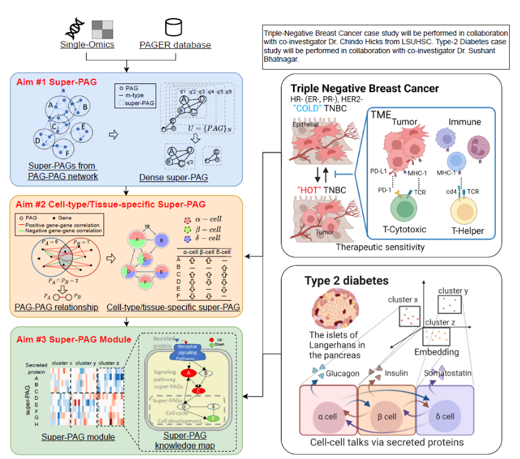
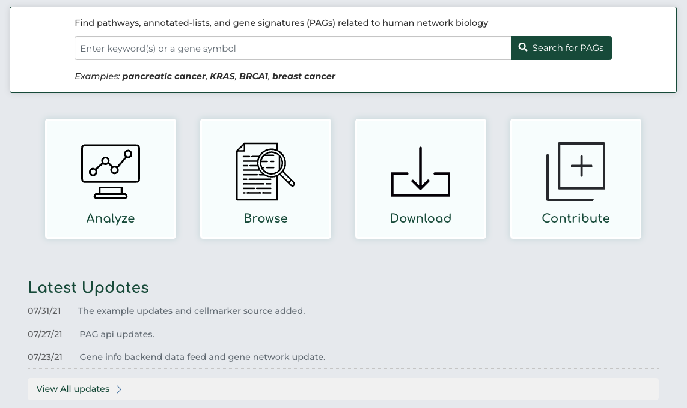

# Super_PAG
The super-PAGs will become a new and comprehensive publicly accessible non-redundant super-geneset source with curated biological context.

# Tasks Todo
[] Run the sample code in PAGER
[] Get familiar with the PAGER 3.0 API
[] Run the top-down optimization method in  
[] Make the optimation code work with PAGER 3.0 API
[] Looking for the literature on clustering algorithms
[] Propose some new clustering methods to apply to our research

# Lead professor
[Dr. Yue](https://pharmacy.auburn.edu/directory/zongliang-yue.php) from Harrison College of Pharmacy. He is an assistant research professor in the Harrison College of Pharmacy's Department of Health Outcomes Research and Policy. He joined the college in March 2023. Dr. Yue's past research has focused on utilizing biological data mining, systems biology, network biology, machine learning, visual analytics, and translational informatics to improve human health. He has also constructed several web servers and applications for functional genomics downstream analysis and drug repositioning.

# Research Strategies

# PAGER 3.0 Dateset [API](http://discovery.informatics.uab.edu/PAGER/)

# Relate works
1. [PAGER: constructing PAGs and new PAG–PAG relationships for network biology](https://www.ncbi.nlm.nih.gov/pmc/articles/PMC4553834/pdf/btv265.pdf)
2. [PAGER 2.0: an update to the pathway, annotated-list and gene-signature electronic repository for Human Network Biology](https://pubmed.ncbi.nlm.nih.gov/29126216/)

